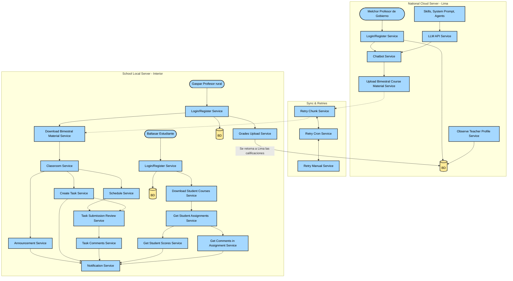

# Lab 4: RemoteSchooly

This laboratory specifies Balbuena EduKanvas from the RemoteSchooly case study using the
repository's Top-Down and R.E.D.A.L.E. structure.

## Structure

| Folder | Content |
| --- | --- |
| [`study-case/`](study-case/) | English translation of the assignment source and its pipeline image. |
| [`people/`](people/) | Government Teacher, Rural Teacher and Rural Student personas. |
| [`core/`](core/) | Product summary, problem, objective, scope, concepts, needs, decisions, experience, flows, phases and acceptance criteria. |
| [`requirements/`](requirements/) | Consolidated functional and non-functional backlogs. |
| [`agents/`](agents/) | Placeholder for the requirements evaluator. |
| [`reports/`](reports/) | Immutable future evaluation iterations. |

## Suggested reading order

1. Read the [case study](study-case/Lab%20%234-%20Arqui2026.2.md).
2. Review [`people/`](people/) and [`core/`](core/).
3. Review the final backlogs in [`requirements/`](requirements/).
4. Use [`agents/`](agents/) and [`reports/`](reports/) after the evaluator is defined.

## Architecture Diagram

