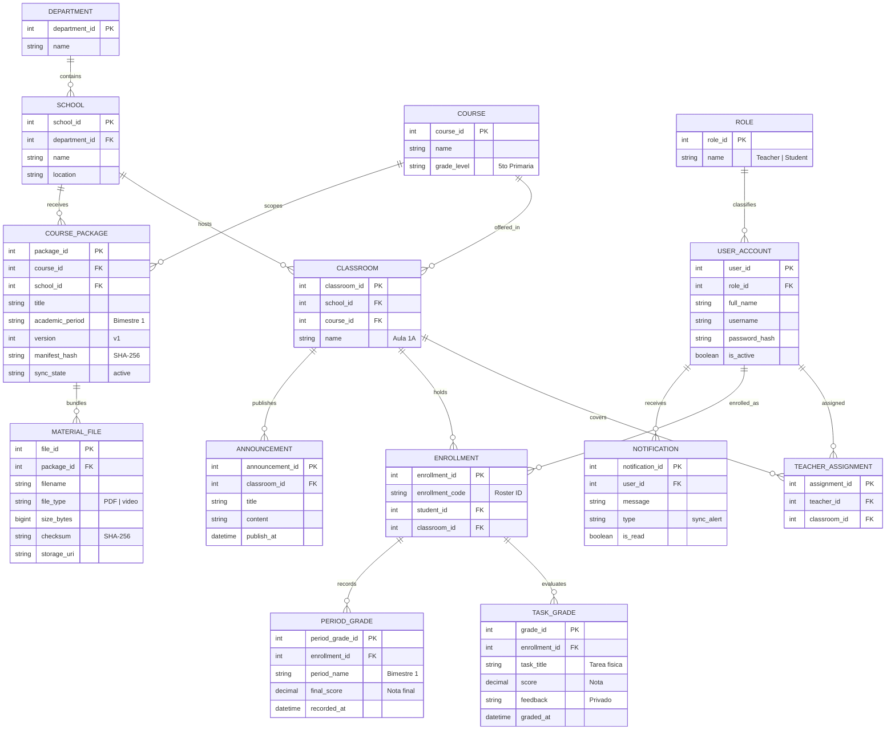

# Modelo de datos — Balbuena EduKanvas (RemoteSchooly)

## 1. Diagrama Entidad–Relación

---

## 2. Diccionario de entidades

### 1. Usuarios, Roles y Estructura Escolar

- **`ROLE`:** Catálogo de perfiles del sistema (`Government_Teacher`, `Rural_Teacher`, `Rural_Student`).
- **`USER_ACCOUNT`:** Credenciales y estado del usuario.
- **`DEPARTMENT`:** Región geográfica (Cusco, Loreto, etc.) para la distribución de contenidos.
- **`SCHOOL`:** Escuela rural donde opera el servidor local por LAN.
- **`COURSE`:** Asignatura que ahora incluye el grado escolar (`grade_level`), eliminando la tabla aislada `GRADE`.
- **`CLASSROOM`:** Aula física en una escuela asignada a un curso.
- **`TEACHER_ASSIGNMENT`:** Asignación del profesor rural a sus aulas.
- **`ENROLLMENT`:** Matrícula del estudiante en su aula con código visible en el roster mínimo sin perfiles expandidos (`FR-04`, `NFR-20`).

### 2. Paquetes y Contenido Educativo

- **`COURSE_PACKAGE`:** Unidad de distribución bimestral creada en Lima. Unifica el concepto de paquete, número de versión (`version`) y estado de sincronización hacia la escuela (`sync_state`: `pending`, `synchronizing`, `active`, `failed`).
- **`MATERIAL_FILE`:** Archivos educativos individuales incluidos en el paquete (videos descargables para reproducción offline, guías en PDF, fichas de trabajo) con su checksum de integridad.

### 3. Dinámica del Aula Rural

- **`ANNOUNCEMENT`:** Avisos y comunicados del docente hacia sus alumnos.
- **`TASK_GRADE`:** Registro de calificación docente para **tareas entregadas físicamente en clase**. Consolida la tarea, la nota (`score`) y la retroalimentación privada (`feedback`). El alumno no responde ni existen foros (`FR-41`).
- **`PERIOD_GRADE`:** Nota bimestral final para consulta local del alumno sin exportación ministerial (`FR-33`, `KPD-10`).
- **`NOTIFICATION`:** Alertas básicas para el docente (llegada de nuevos paquetes o alertas de sincronización).

---

## 4. Matriz de trazabilidad con requerimientos

| Requerimiento     | Descripción                                         | Soporte en el modelo                                                       |
| ----------------- | --------------------------------------------------- | -------------------------------------------------------------------------- |
| **FR-01, FR-02**  | Login por credenciales y autorización por rol/aula  | `USER_ACCOUNT`, `ROLE`, `CLASSROOM`, `ENROLLMENT`                          |
| **FR-03**         | Configuración de estructura académica por admin     | `DEPARTMENT`, `SCHOOL`, `COURSE`, `CLASSROOM`, `TEACHER_ASSIGNMENT`        |
| **FR-04**         | Roster mínimo para profesor rural                   | `ENROLLMENT.enrollment_code`, `USER_ACCOUNT.full_name`                     |
| **FR-05..08**     | Paquete bimestral con archivos multiformato         | `COURSE_PACKAGE`, `MATERIAL_FILE` (`file_type`, `storage_uri`)             |
| **FR-14..16**     | Publicación versionada y estado de distribución     | `COURSE_PACKAGE.version`, `COURSE_PACKAGE.sync_state`                      |
| **FR-17..22**     | Verificación de integridad y activación en escuela  | `MATERIAL_FILE.checksum`, `COURSE_PACKAGE.manifest_hash`, `sync_state`     |
| **FR-24, 25**     | Uso de material en aula por LAN                     | `COURSE_PACKAGE`, `MATERIAL_FILE` accesibles desde el servidor de `SCHOOL` |
| **FR-27..29**     | Anuncios y tareas del docente rural                 | `ANNOUNCEMENT`, `TASK_GRADE`                                               |
| **FR-30..32**     | Calificación y feedback de tareas físicas           | `TASK_GRADE.score`, `TASK_GRADE.feedback`                                  |
| **FR-33**         | Notas bimestrales locales                           | `PERIOD_GRADE.final_score`                                                 |
| **FR-34**         | Notificaciones básicas para el profesor             | `NOTIFICATION`                                                             |
| **FR-35, 36, 40** | Consulta privada de notas y material del estudiante | Filtrado por `ENROLLMENT` en `COURSE_PACKAGE` y `TASK_GRADE`               |
| **FR-41**         | Sin foros ni réplicas de los alumnos                | Diseño unidireccional en `TASK_GRADE` (solo lectura para el alumno)        |
