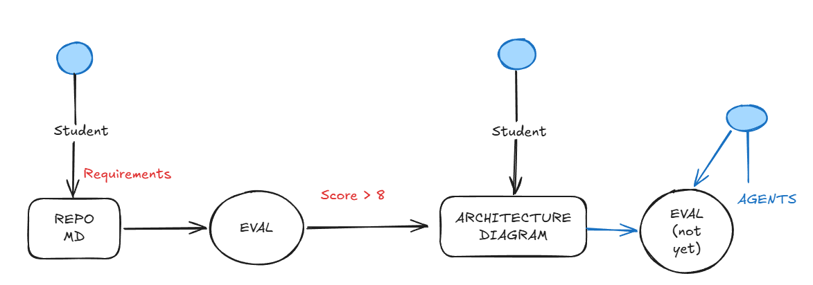

# Lab 4 — Software Architecture

This file is an English translation of the supplied assignment document.

## Lab information

| Field | Value |
| --- | --- |
| Course | Software Architecture |
| Case study | RemoteSchooly |
| Term | 2026-II |
| Difficulty | Medium |
| Background | Top-down design and R.E.D.A.L.E. |
| Score | 20 points |

## Case study: RemoteSchooly

> You have been selected by the Government of Peru to provide online education to remote
> Peruvian communities. Internet access is limited in these communities, but students need
> access to weekly learning material so teachers can teach without disruption. Material
> originates at a central location in Lima and is distributed to every region, including the
> most distant regions with limited internet access.

> Another identified issue is that teachers who create course material use too much AI
> through the platform, generating high token costs. As the architect, you are asked to
> optimize the solution and reduce token expenditure by at least 40%.

## Deliverables

- Requirements Eval.
- Architecture diagram.
- It is not necessary to guarantee 100% availability yet, but courses must arrive correctly.
- Reliability mechanisms are not required yet.

## Lab pipeline so far

The diagram shows the flow from student requirements in a Markdown repository to an
evaluation scoring above 8, an architecture diagram and a later agent-based evaluation.

## Rubric

| Criterion | Score |
| --- | ---: |
| Requirements | 3 points |
| Eval 8/10 Passed | 2 points |
| Architecture diagram | 10 points |
| Happy path(s) represented in the diagram | 5 points |
